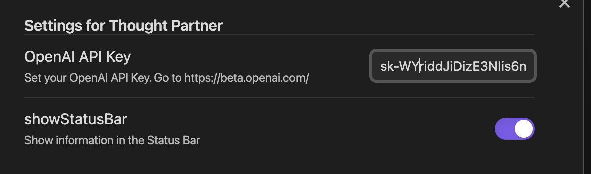

# ThoughtPartner for Obsidian

  

The **Obsidian Thought Partner plugin** brings the power of GPT-3 to Obsidian.

It's aim is to not just be an easy way to generate text, but to help you think through your ideas and be a better writer.

# Installation

## 1. Manually install the plugin

Download the zip of this repo and unzip it into your vault's `<vault>/.obsidian/plugins/` folder, then reload Obsidian.

Note: the .obsidian folder may be hidden. O n MacOS you should be able to press `Command+Shift+Dot` to show the folder in Finder.

## 2. Bring your own OpenAI key

Thought Partner uses GPT-3. It's free software, you'll just pay (the very reasonable) cost of the tokens to GPT-3 (and you'll have $18 of free credit).

1. Create an account on [OpenAI](https://beta.openai.com/signup)

2. Grab your API key from [https://beta.openai.com/account/api-keys](https://beta.openai.com/account/api-keys)

3. Paste your API key into the plugin settings

After installing and enabling the ThoughtPartner plugin, go to the settings in Obsidian and add your API key in settings.

  

# Usage Guide

## Understanding the context window

To use the plugin efffectively you need to understand the context that the AI considers. If text is selected, it will use that. If the line is empty it will use as much of the previous content as possible. For features like "tldr" it will use the whole file.

## Possible commands

You can access the commands through the command pallette, the right-click menu or keyboard shortcuts.
Please use the feedback buttons ('good'/'bad') on the generations, to help improve the prompts used for each feature.

### **extend** `ctrl+j`

_Take the context and generate the next few sentences_

### **tldr** `ctrl+t`

_Generate a summary of the file and insert it at the top_

### **critique** `ctrl+q`

_ThoughtPartner will outline possible assumptions or flaws in your reasoning_

### **prose-ify**

_Convert your crappy bullet points notes into flowing prose_

### **suggestions**

_ThoughtPartner will sympathetically evaluate your writing and suggest where there is "room for improvement"_

# Terms and policy

Your requests and responses will go via Humanloop to OpenAI's API. See the OpenAI [terms](https://openai.com/api/policies/terms/) to understand how that data will gets used.
